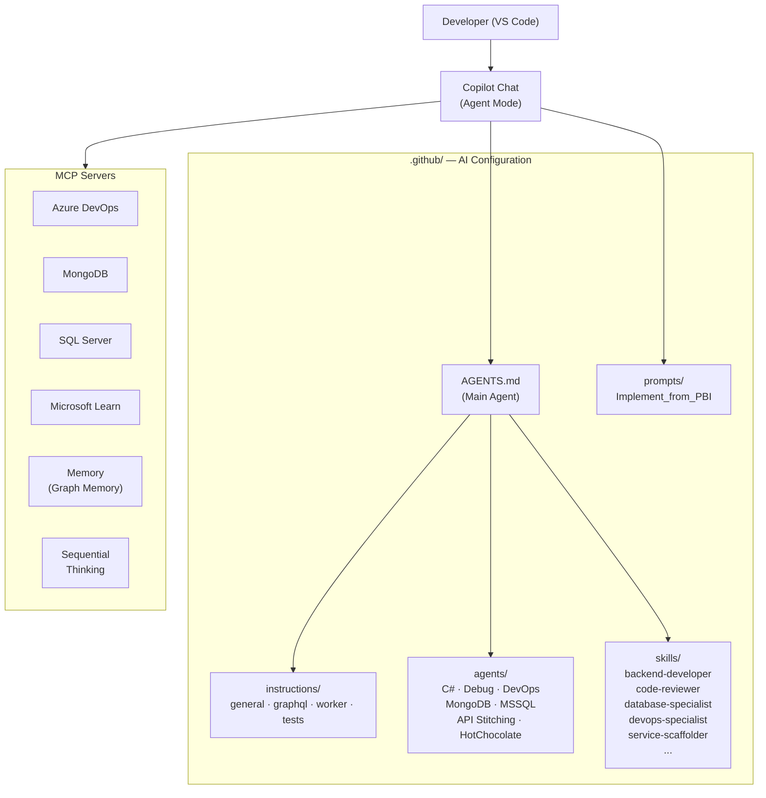

# Vibe-Coding-Dev-Setup

## Introduction

This repository contains a complete developer setup for .NET backend **vibe coding with GitHub Copilot** in VS Code. It solves two problems:

1. **Automatically install and configure MCP servers** — a single script sets up all required MCP servers (Model Context Protocol) so Copilot can access Azure DevOps, databases, Microsoft Docs, and other services.
2. **Provide unified coding standards for the AI agent** — Instructions, Skills, Agents, and Prompts in the `.github/` folder control *how* Copilot generates code, reviews it, and tests it.

The result: You open VS Code, start the Copilot Chat in **Agent Mode**, and immediately have an agent that knows your project conventions, can access your ADO work items, and produces code according to your standards.

> **Using a different tech stack?** This setup is built for .NET, but it can be adapted for any stack. See [CUSTOMIZATION.md](CUSTOMIZATION.md) for step-by-step migration examples (REST instead of GraphQL, Jira instead of Azure DevOps, Java instead of C#, and more).

---

## Prerequisites

Before you run the setup, make sure the following tools are installed and available:

| Tool | Minimum Version | Check Command | Note |
|------|-----------------|---------------|------|
| **Node.js** | 20.0.0 | `node --version` | LTS version recommended |
| **npm** | (with Node.js) | `npm --version` | Required for `npx` |
| **VS Code** or **VS Code Insiders** | Current | — | Copilot Extension must be installed |
| **GitHub Copilot** | Current | — | License required (Individual, Business, or Enterprise) |
| **Git** | Current | `git --version` | For symlinks and repo management |

### Environment Variables (Optional)

Some MCP servers require connection strings as environment variables. You can set these before starting VS Code:

| Variable | Purpose | Example |
|----------|---------|---------|
| `MDB_MCP_CONNECTION_STRING` | MongoDB connection for the MongoDB MCP server | `mongodb://localhost:27017` |
| `MSSQL_MCP_CONNECTION_STRING` | SQL Server connection for the MSSQL MCP server | `Server=localhost;Database=mydb;...` |

> **Tip:** Set variables permanently via Windows System Environment Variables or a `.env` file in your profile so they're available every time VS Code starts.

---

## Initial Setup

### Why a Setup Script?

GitHub Copilot in Agent Mode can access external tools and services via the **Model Context Protocol (MCP)**. Each MCP server must be registered in the VS Code configuration (`mcp.json`). Maintaining this manually is error-prone and time-consuming — especially when multiple servers with binaries, Docker containers, and NPX packages need to work together.

The setup script handles everything in a single pass:
- **Pre-load NPX packages** — so the first start of MCP servers is fast
- **Generate and merge `mcp.json`** — for VS Code *and* VS Code Insiders, without overwriting existing entries

### Running the Setup

```bash
# Clone the repository
git clone <repo-url> C:\Repos\Vibe-Coding-Dev-Setup
cd C:\Repos\Vibe-Coding-Dev-Setup

# Run once
npm run setup-mcp
```

The script automatically detects whether you're on Windows or macOS and adjusts paths and binaries accordingly.

### Options

| Command | Description |
|---------|-------------|
| `npm run setup-mcp` | Full setup (all MCP servers + cache) |
| `npm run setup-mcp:dry-run` | Shows what would be done **without** making any changes |
| `npm run setup-mcp:quick` | Skips cache warming — for quick re-setup |

Individual steps can also be skipped:

```bash
node setup-mcp-servers.mjs --skip-cache-warm      # No NPX cache warming
```

### What Gets Installed?

After setup, the following MCP servers are configured:

| # | Server | Type | Purpose |
|---|--------|------|----------|
| 1 | **azure-devops** | npx, stdio | Access Work Items, Repos, Pipelines, Wikis in Azure DevOps |
| 2 | **sequential-thinking** | npx, stdio | Structured thinking for complex problem-solving |
| 3 | **microsoft-learn** | HTTP (remote) | Search and retrieve official Microsoft documentation |
| 4 | **memory** | npx, stdio | Knowledge Graph for persistent agent memory |
| 5 | **mongodb** | npx, stdio | Direct access to MongoDB databases |
| 6 | **mssql** | npx, stdio | Direct access to SQL Server databases |

The configuration is written to these files:
- **VS Code:** `%APPDATA%\Code\User\mcp.json`
- **VS Code Insiders:** `%APPDATA%\Code - Insiders\User\mcp.json`

> **Important:** Restart VS Code after setup. When first opening Copilot Chat in Agent Mode, activate the desired MCP servers under **"Select Tools"**. The Azure DevOps server will ask for the organization name on first use.

### Setup for MonoRepos

In a MonoRepo setup (e.g., `My-Backend/`), you want to use the `.github/` artifacts (Instructions, Skills, Agents, Prompts) **without copying them to each repository**. The solution: **Symbolic Links (Symlinks)**.

#### Why Symlinks?

- **Single Source of Truth** — Changes to Instructions or Skills are maintained centrally in this repository
- **No Duplicates** — no manual synchronization between repositories
- **Git-compatible** — Symlinks are tracked by Git (on Windows, Developer Mode must be active or Git configured with `core.symlinks=true`)

#### Creating Symlinks

Open an **administrative PowerShell** (or ensure Windows Developer Mode is active) and create the symlink in the target repository:

```powershell
# In the target repository (e.g., My-Backend)
cd C:\Repos\My-Backend

# Symlink for the entire .github folder
New-Item -ItemType SymbolicLink -Path ".github" -Target "C:\Repos\Vibe-Coding-Dev-Setup\.github"
```

If the target repository already has a `.github` folder (e.g., with workflows), link only the relevant subfolders:

```powershell
# Link only agent-specific folders
New-Item -ItemType SymbolicLink -Path ".github\instructions" -Target "C:\Repos\Vibe-Coding-Dev-Setup\.github\instructions"
New-Item -ItemType SymbolicLink -Path ".github\skills"       -Target "C:\Repos\Vibe-Coding-Dev-Setup\.github\skills"
New-Item -ItemType SymbolicLink -Path ".github\agents"       -Target "C:\Repos\Vibe-Coding-Dev-Setup\.github\agents"
New-Item -ItemType SymbolicLink -Path ".github\prompts"      -Target "C:\Repos\Vibe-Coding-Dev-Setup\.github\prompts"

# Optional: AGENTS.md in root
New-Item -ItemType SymbolicLink -Path ".github\AGENTS.md"    -Target "C:\Repos\Vibe-Coding-Dev-Setup\.github\AGENTS.md"
```

#### Verification

```powershell
# Verify symlink
Get-Item ".github\instructions" | Select-Object Name, LinkTarget
```

> **Note for Git on Windows:** Ensure `git config core.symlinks true` is set so symlinks are checked out correctly. Symlinks work without admin rights in Windows Developer Mode (Settings → For Developers).

---

## Working with the Agent

Once the setup is in place, it's time to do the actual work. This chapter explains how the AI configuration is structured and how to use it effectively.

### Architecture Overview

The following diagram shows how the components interact:



### Structure

All AI-related artifacts are in the `.github/` folder and are automatically recognized by VS Code / Copilot:

```
.github/
├── AGENTS.md                      # Main agent definition (always loaded)
├── instructions/                  # Coding standards and conventions
│   ├── general.instructions.md    #   → Applies to all files (**)
│   ├── graphql.instructions.md    #   → Applies to GraphQL layer (**/GraphQL/**/*.cs)
│   ├── worker.instructions.md     #   → Applies to Worker layer (**/Worker/**/*.cs)
│   └── tests.instructions.md      #   → Applies only to test files (**/test/**/*Tests.cs)
├── agents/                        # Specialized agents
│   ├── APIStitchingExpert.agent.md #   → Schema stitching, query delegation
│   ├── CSharpExpert.agent.md      #   → C#/.NET design, patterns, performance
│   ├── DebugExpert.agent.md       #   → Build errors, runtime exceptions
│   ├── DevOpsExpert.agent.md      #   → Pipelines, Docker, Kubernetes
│   ├── HotChocolateExpert.agent.md #  → Advanced HotChocolate v15, schema design
│   ├── MongoDBExpert.agent.md     #   → Schema design, indexing, queries
│   └── MSSQLExpert.agent.md       #   → Stored procedures, execution plans
├── skills/                        # Domain-specific knowledge
│   ├── backend-developer/         #   → HotChocolate, MassTransit, MongoDB repos
│   ├── code-reviewer/             #   → Code review per project standards
│   ├── database-specialist/       #   → Data pipeline implementation
│   ├── devops-specialist/         #   → Pipeline templates, Helm, K8s patterns
│   ├── service-scaffolder/        #   → Scaffold new microservices end-to-end
│   ├── prompt-creator/            #   → Write and optimize prompts
│   └── ...                        #   → other skills (docx, pdf, xlsx, pptx, ...)
└── prompts/                       # Reusable prompt workflows
    └── Implement_from_PBI.prompt.md  # → Implement feature end-to-end from ADO PBI
```

#### What is What?

| Artifact | Description | When Loaded? |
|----------|-------------|--------------|
| **AGENTS.md** | Defines the main agent: persona, trust boundary, non-negotiable patterns, workflow, and delegations to specialist agents | Always (on every chat) |
| **Instructions** | Coding standards that Copilot must follow when generating code (e.g., naming conventions, architecture rules, test patterns) | Automatically based on `applyTo` pattern |
| **Agents** | Specialist expert agents that the main agent delegates to as needed (e.g., C# questions → CSharpExpert) | By main agent as needed or directly via `@agent` |
| **Skills** | Deep domain knowledge with concrete code examples and patterns from the project. Skills are automatically loaded when Copilot detects they're relevant | Automatically on relevant context |
| **Prompts** | Predefined multi-step workflows for recurring tasks (e.g., feature implementation from PBI to PR) | Manually via prompt menu |

### Working with Prompts

Prompts are predefined workflows that you trigger through Copilot Chat. They provide a structured approach for complex tasks.

#### Using a Prompt

1. Open **Copilot Chat** in Agent Mode (the agent icon in the chat window)
2. Type `/` and select the desired prompt from the list
3. Follow the prompt's instructions — for example, it might ask for a PBI number

#### Example: Implement Feature from PBI

The `Implement_from_PBI` prompt guides you through the entire implementation process:

1. **Phase 0 — Identify PBI:** You provide the Work Item ID
2. **Phase 1 — Analysis:** The agent reads the PBI, parent, children, and linked items from Azure DevOps
3. **Phase 2 — Codebase Analysis:** The agent examines affected domain services and their patterns
4. **Phase 3 — Implementation Plan:** A step-by-step plan is created — you confirm it before code is written
5. **Phase 4 — Implementation:** Step by step, compilation and tests run after each step
6. **Phase 5 — Write Tests:** Unit tests per project conventions, target ≥82% coverage on new code
7. **Phase 6 — Code Review:** The `code-reviewer` skill checks changes against project standards

> **Important:** The agent waits for your explicit confirmation after Phase 3. You always stay in control of the plan before code is generated.

### Working Without Prompts

You don't need to use prompts to be productive. The agent is powerful in free chat mode too, because **Instructions and Skills are automatically loaded**.

#### Direct Dialog

Simply ask the agent questions or give instructions:

```
"Add a new property 'ExpirationDate' of type DateTimeOffset 
 to the Contract model and adapt all affected layers."
```

The agent will:
- Follow `general.instructions.md` (naming, architecture rules)
- Load the `backend-developer` skill (HotChocolate resolver pattern, MongoDB repository)
- Work step-by-step through the layers (Abstractions → Core → DataAccess → GraphQL)

#### Call Specialist Agents Directly

You can also address specialized agents directly:

```
"@CSharpExpert How should I best implement the Repository pattern here 
 with a generic base class?"
```

```
"@DebugExpert This MassTransit consumer throws a NullReferenceException. 
 Help me debug it."
```

```
"@MongoDBExpert Analyze the indexes on the contracts collection and 
 suggest improvements."
```

#### Use MCP Servers Directly

The MCP servers are automatically available to the agent. You can ask it to actively use them:

```
"Show me the open PBIs in the current sprint."

"Search Microsoft documentation for best practices 
 on HotChocolate DataLoader."

"What does the schema of the 'contracts' collection look like in the database?"

"Create an overview of the last 10 commits in the My-Backend repo."
```

### Best Practices for Effective Work

#### 1. Provide Context

The more context you give, the better the result:

```
❌ "Add a field."
✅ "Add a property 'LastModifiedBy' (string, required) to the 
    ConsultationDocument model in the Consultation service. 
    It should be exposed in the GraphQL schema and set 
    in the repository on update."
```

#### 2. Work Incrementally

Break large changes into small steps:

```
Step 1: "Create the new model in Abstractions."
Step 2: "Implement the service in Core."
Step 3: "Add the repository in DataAccess."
Step 4: "Expose it via GraphQL."
Step 5: "Write the unit tests."
```

#### 3. Get Code Reviews

After larger changes:

```
"Review my current changes on this branch."
```

The `code-reviewer` skill is automatically loaded and checks against project standards.

#### 4. Validate Results

Trust but verify:
- **Does the code compile?** — The agent should run `dotnet build` after each step
- **Do the tests pass?** — Existing tests must not break
- **Is the architecture correct?** — No HotChocolate dependencies in the Core layer, no business logic in the API layer

---

## Customize Configuration

### Extend Instructions

Instructions in `.github/instructions/` are automatically loaded based on the `applyTo` pattern. To add new standards:

1. Create a new `.instructions.md` file
2. Define in the frontmatter which files it applies to:

```yaml
---
applyTo: "**/src/**/GraphQL/**/*.cs"
---
```

3. Write the rules as clear, imperative instructions

### Add Skills

A new skill consists of a folder under `.github/skills/` with a `SKILL.md` file:

```
.github/skills/my-new-skill/
└── SKILL.md
```

The `SKILL.md` contains:
- **Frontmatter** with name, description, and trigger keywords
- **Concrete domain knowledge** with code examples from the project
- **Dos and Don'ts** for the specific context

> **Tip:** Use the `skill-creator` skill to create new skills in a structured way: *"Create a new skill for [domain]."*

### Add Agents

New agents are stored as `.agent.md` files under `.github/agents/`. Each agent defines:
- **Persona and expertise** — which area they're expert in
- **Rules and conventions** — specific patterns they must follow
- **Workflow** — how they approach tasks

> **Tip:** Use the `agent-creator` skill to create new agents in a structured way: *"Create a new agent for [domain]."*

---

## Troubleshooting

### MCP servers don't start

1. **Restart VS Code** — MCP servers are initialized on startup
2. **Activate MCP servers** — In Copilot Chat under "Select Tools" check if servers are enabled
3. **Check logs** — `Ctrl+Shift+P` → "Output: Show Output Channel" → select "GitHub Copilot Chat"
4. **Check `mcp.json file`** — Open the file and ensure configuration is correct:
   ```
   %APPDATA%\Code\User\mcp.json
   ```

### Azure DevOps server reports errors

- Make sure you're logged into GitHub **and** Azure DevOps in VS Code
- On first use, you'll be asked for the ADO organization name — provide it without URL prefix (e.g., `myorg`, not `https://dev.azure.com/myorg`)

### Run setup again

The script can be run again at any time. Existing `mcp.json` entries are merged, not overwritten:

```bash
npm run setup-mcp
```

---

## Conclusion

This setup gives you an AI coding agent that:

- **Knows your conventions** — through Instructions and Skills in the `.github/` folder
- **Can access your tools** — Azure DevOps, MongoDB, SQL Server, Microsoft Docs
- **Works in a structured way** — through predefined prompts for recurring workflows
- **Can specialize** — through agents for C#, debugging, DevOps, databases, API stitching

The key to effective work: **provide context, work incrementally, validate results.** The agent is a powerful tool — but you remain the architect.

---

## Smoke Test

After setup, verify everything works by asking these three questions in Copilot Chat (Agent Mode):

### 1. MCP Server Connectivity

```
Search Microsoft Learn for "HotChocolate DataLoader best practices".
```

Expected: The agent uses the `microsoft-learn` MCP server and returns documentation results.

### 2. Agent & Skill Loading

```
Review the coding standards that apply to test files in this project.
```

Expected: The agent references `tests.instructions.md` and summarizes the test conventions (xUnit, Moq, FluentAssertions, naming pattern `MethodName_Scenario_ExpectedBehavior`).

### 3. Sequential Thinking

```
Break down the steps needed to add a new "Notes" property (string, optional) 
to an existing entity in the Consultation service.
```

Expected: The agent uses sequential thinking to produce a layered plan (Abstractions → Core → DataAccess → GraphQL → Tests).

If all three produce meaningful results, your setup is working correctly.

---

## License

This project is licensed under the **GNU General Public License v3.0** with two Section 7 additional terms:

1. **Patent Grant** — Contributors grant an irrevocable patent license for the Work
2. **Attribution Requirement (Section 7b)** — The original author and source repository must be retained in all copies and derivative works:
   > **Original Author:** Andreas Karz | **Source:** [github.com/AndreasKarz/DotNET-Developer-AI-Setup](https://github.com/AndreasKarz/DotNET-Developer-AI-Setup)

See [LICENSE](LICENSE) for the full text.

### Third-Party Skills

Some skills bundled under `.github/skills/` are third-party works with their own licenses:

| Skill | License | License File |
|-------|---------|--------------|
| `docx`, `pdf`, `pptx`, `xlsx` | Anthropic Proprietary | `LICENSE.txt` in each skill folder |
| `skill-creator`, `agent-creator`, `prompt-creator` | Apache License 2.0 | `LICENSE.txt` in each skill folder |

All other skills, agents, instructions, and prompts fall under the repository's GPLv3 + Patent Grant license.

---

## Architecture Review Summary

**Reviewed:** All 4 instructions, 7 agents, 17 skills, 1 prompt, AGENTS.md, LICENSE
**Perspective:** Senior Architecture Review (second-pass audit after initial review + implementation of all findings)

### Verdict: APPROVED — Production-Ready

The `.github/` agent configuration is well-architected, consistent, and ready for use as a template repository.

### What Was Verified

| Category | Status | Details |
|----------|--------|---------|
| **Trust Boundary** | **Centralized** | Single definition in `general.instructions.md`, all 7 agents + AGENTS.md reference it via one-liner — zero duplication |
| **Layer-Specific Instructions** | **Complete** | 4 instruction files with correct `applyTo` patterns: `**` (general), `**/GraphQL/**/*.cs`, `**/Worker/**/*.cs`, `**/test/**/*Tests.cs` |
| **Agent Sizing** | **Appropriate** | MongoDBExpert and MSSQLExpert trimmed to Quick Reference + skill pointer; no agent exceeds ~250 lines of domain-specific content |
| **Skill–Agent Separation** | **Clean** | Agents diagnose and orchestrate; skills provide implementation knowledge; no role overlap |
| **Cross-References** | **Consistent** | Delegation tables in AGENTS.md and all agents match the actual skill/agent inventory |
| **License Structure** | **Correct** | GPLv3 + Patent Grant for repo; Apache 2.0 LICENSE.txt in creator skills; Proprietary LICENSE.txt in office skills; frontmatter `license` field present where applicable |
| **Prompt Architecture** | **Clean** | `Implement_from_PBI.prompt.md` references AGENTS.md for persona — no re-declaration |
| **Dependency Rules** | **Single Source** | Layer dependency graph defined once in `general.instructions.md`; DebugExpert references it instead of duplicating |

### Architecture Strengths

1. **Token Efficiency** — Centralized trust boundary and deduplicated layer rules keep every agent prompt lean. Agent-level context stays within ~200-250 lines of domain-specific content.
2. **Clear Separation of Concerns** — Instructions set conventions, agents orchestrate and diagnose, skills provide deep implementation knowledge. No role bleed between the three.
3. **Self-Learning Agents** — HotChocolateExpert and DevOpsExpert fetch latest documentation before acting, reducing stale-knowledge risk.
4. **Composable Design** — Symlink support enables the `.github/` folder to serve multiple repositories from a single source of truth.
5. **Security Posture** — Trust boundary is comprehensive (12 untrusted source categories including DB results, pipeline YAML, and GraphQL schemas), with explicit injection-detection guidance.

